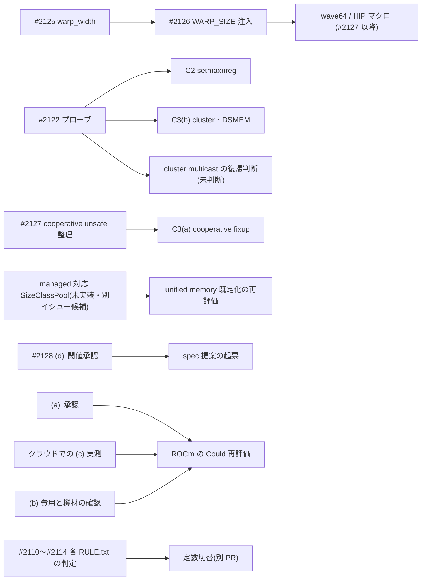

# チップ別最適化ロードマップと各プラットフォームの Non-Goal 総括（#2129）

基準コミット: `3a88907a`（origin/main。#2122 PR-C〈#2476〉マージ後）。`docs/spec` submodule ポインタは `2e998dd77117814f4af8ed160394ad1d6a8f888a`。

- **docs 専用・コード変更ゼロ**（`crates/**`・`Cargo.toml`／`Cargo.lock`・`docs/spec`〈正本 submodule〉・tolerance／baseline・ガードレール閾値・本番既定値・依存は無変更）
- **新規実測なし**。数値と判定語はすべて既存記録からの転記で、出典（`file:§`）を付ける。未計測の欄は「未計測」、推定は「推定」、裏取りできない欄は「未確認」と書く
- 本 doc は**総括**であり、候補の着手可否・既定値の切替・spec 改定は決めない（すべてユーザー承認事項。§9・§10 に送る）
- 親 #2121（Phase 4「チップ情報に基づく最適化の考察」）の兄弟 #2122〜#2128・#2130 の成果を 1 本に統合する

## §0 結論（最初に読む）

### 0.1 プラットフォーム別の一行結論

| プラットフォーム | 結論 |
|---|---|
| CUDA（sm_121／GB10） | 本番結線済みは tiled pipeline 128×64 と `WARP_SIZE` 注入（rmsnorm／softmax／mse）。REJECT 4 件のうち StreamK・TMA Stage 1 は (D)／(I) 起因で再挑戦可、persistent は価値低、3×TF32 は opt-in 維持・非推奨（ユーザー判断確定）。#2122 の GB10 実測で cluster 2／4／8・DSMEM・`tma.multicast`・`setmaxnreg`（121a／121f）は「成立」、tcgen05／TMEM／wgmma は「ptxas 拒否（オフライン）」。新規候補 C1〜C4 はいずれも設計のみ |
| Metal（M4 Max） | 本番結線済みの ADOPT 施策は split-K のみ。async copy・aligned load・Morton・E6〜E8 は Non-Goal。MPP（Route C）はユーザー判断待ち。#2110〜#2114 は opt-in・既定 OFF・M4 Max 実測未実施 |
| AMD ROCm | readiness 1（#2125）・2（#2126）は実装済み、3（#2127）は設計のみ（unsafe 未承認）。`backend-rocm` 本体は Won't（条件付き）据え置き。**Non-Goal 確定（v1.0 スコープ外）を推奨**（0.3） |

### 0.2 v1.0 候補に向けた推奨優先順位（上位 5 件。詳細は §8）

1. 実機実測の申し送りの消化（GB10 unified memory R-UM-*、#2126 の `#[ignore]` bit 一致再実行、M4 Max の #2111〜#2114、#2120 の両機体再計測）。低コストで状態が確定する
2. 診断のみの issue（CTA→SM 分布プローブ、TMA N=256 判別実験）。いずれも sm121 設計 doc §7 で優先度「高」
3. Metal の `MTLCounterSampleBuffer` counter set プローブ（推定の裏取り用。m4max §9）
4. CUDA 候補 C1（TMA Stage 2）の P-diag 実装 → ゲート A〜D → 本番結線の順（sm121 設計 doc §6・§7。優先度「中」）
5. C3(a) cooperative fixup（優先度「中」。#2127 と security-auditor 監査が前提。§8 の 5 位と一致。縮約カーネル残り群の `WARP_SIZE` 注入は優先度「未設定」のため §8 の 7 位で、上位 5 件には含めない）

### 0.3 ROCm の推奨（決定ではない）

- 推奨: **「ROCm は Non-Goal 確定（v1.0 のスコープ外）」**。根拠は `docs/rocm-grade-up-conditions-v2-spec-proposal.md` §8 の発火条件で、#2129 の時点までに (a)' の承認もクラウドスパイクも実施されていないため該当する（2026-10-01 時点の open issue・PR 検索で該当なし）
- **未承認**: 確定には (i) ユーザー承認と、(ii) spec 側で Won't の条件記述を条件なしの Won't へ改める追加提案（fandhe-ai-spec 側）が必要。本 doc は spec を編集しない

## §1 位置づけ・入力集合

| 区分 | issue | 成果 doc（実際に読んだもの） |
|---|---|---|
| CUDA ISA プローブ | #2122（PR #2474・#2475・#2476） | `docs/cuda-sm121-isa-probe.md`、`docs/perf/logs/sm121-isa-probe-2122/aggregate.md` |
| CUDA GEMM 候補の再分類 | #2130 | `docs/cuda-sm121-gemm-candidates-design.md` |
| GB10 unified memory・Grace CPU | #2123（PR #2470）、#2117 | `docs/gb10-unified-memory-grace-cpu-consideration.md`、`docs/backend-cpu-gb10-affinity-design.md`、`docs/perf/logs/cpu-gb10-affinity-ab-2117/` |
| M4 Max Metal | #2124 | `docs/backend-metal-m4max-optimization-considerations.md` |
| AMD readiness | #2125・#2126（PR #2472）・#2127 | `docs/backend-abstraction-amd-readiness-decision.md`、`docs/rocm-cooperative-hiprtc-unsafe-readiness-decision.md` |
| ROCm spec 提案 | #2128（PR #2473） | `docs/rocm-grade-up-conditions-v2-spec-proposal.md` |
| 横断 | - | `docs/backend-matrix.md` §3.4、`docs/perf/performance-floor-decision.md`、各 `docs/backend-*-decision.md` のスコープ外節 |

`docs/perf/` 配下の `-decision.md` は `performance-floor-decision.md` の 1 件のみで、決定記録の大半は `docs/*-decision.md` にある（§2）。

## §2 前提の訂正

Issue 本文の想定と HEAD の記録が食い違う点を、黙って直さずここに記録する。

| 項目 | Issue の記載 | HEAD の実際 | 本 doc での扱い |
|---|---|---|---|
| Metal の参照 doc | `docs/backend-metal-async-command-batching-design.md` | **存在しない**。実在は `docs/backend-metal-command-batching-design.md`（スコープ外は §6.3） | 実在ファイルを参照 |
| decision 群の場所 | `docs/perf/` 配下のすべての `-decision.md` | `docs/perf/` 配下は `performance-floor-decision.md` のみ | §1 に入力集合を列挙 |
| ROCm の参照先 | #2128 の提案を反映した最新版 | #2128 の (b) 形式提案（§5）は**未起票**で、§6 の承認事項もすべて未実施。spec 本文は旧条件のまま（`docs/spec/04-requirements.md:367` @ `2e998dd`。#2128 doc は `:365-369` と記録） | spec 現行条文を正とし、#2128 は「未反映の提案」として別に引く（§10） |
| sm_121 の cluster | 1×1×1 のみ（`cuda-tensor-core-design.md` §11.1 の静的読解） | #2122 の GB10 実測で cluster 2／4／8・DSMEM・`tma.multicast` は 3 target とも「成立」、cluster 16 は「実行時エラー」（`cuda-sm121-isa-probe.md` §5・§5.1） | 前提は覆った。ただし候補への復帰は**未判断**と記録 |
| Issue タイトルの `docs(spec)` | 総括を spec 扱いとする表現 | 本 doc は実装リポの docs。`docs/spec/` は編集禁止 | spec 側の変更は「提案」として記述するだけ |

## §3 分類語彙の対応表（新語彙は作らない）

既存の 2 体系を、Issue の 2 軸（物理的限界／実装・リソース・設計起因）へ対応付ける。

| 本 doc の根拠種別 | CUDA（`cuda-sm121-gemm-candidates-design.md` §3） | Metal（`backend-metal-m4max-optimization-considerations.md` §3） |
|---|---|---|
| 物理的限界 | (H) ハードウェア限界、ISA の ptxas 拒否 | (G) Neural Accelerator 非搭載・GPU counters 非対応、(A) API 非公開・非公式 ABI、(B) 標準 API の抽象化による制御不能 |
| 契約・規約による除外 | REQ-2 の精度契約（f8f6f4 等） | (E) REQ-8（境界検査）抵触、(F) REQ-1 の解釈待ち |
| 実装・リソース・設計起因 | (I) 実装の不完全さ、(D) 設計・机上モデル起因 | (C) 実測で後退、(D) 安定性ゲート不成立で判定不可、(H) 実機実測待ち |
| protocol・固定費支配／メモリ物理 | (D) の一部（StreamK の fixup 固定費）、Grace の DRAM 帯域律速 | UMA readback の first-touch（仮説段階） |

「物理的限界」に分類されるのは Metal の (A)(B)(G) と CUDA の ISA 拒否に限る。(A)(B) は Metal の標準 API 下での制約であり、将来の API 公開で変わりうる点で CUDA の (H) とは性質が異なる。

## §4 ロードマップ表

状態の細分値: 本番結線済み（既定 ON）／opt-in・既定 OFF・実測待ち／設計のみ／REJECT（実測）／ユーザー判断待ち／Non-Goal。Issue の 3 値との対応は、実装済み＝本番結線済み、設計済み＝設計のみ・opt-in・ユーザー判断待ち、Non-Goal＝Non-Goal・REJECT のうち再挑戦しないもの。

「既定 ON／OFF」はソース定数で裏取りした（`3a88907a`）:

| 定数 | 値 |
|---|---|
| `crates/backend-metal/src/split_k_runtime.rs:84` `SPLIT_K_DEFAULT_ENABLED` | `true` |
| `crates/backend-cuda/src/gemm.rs:1290` `TILED_PIPELINE_128X64_PRODUCTION_ENABLED` | `true` |
| `crates/backend-cpu/src/gb10_affinity.rs:126` `GB10_AFFINITY_ENABLED` | `false` |
| `crates/backend-metal/src/tile.rs:1510` `SWIZZLE_ENABLED` | `false` |
| `crates/backend-metal/src/tile.rs:1576` `UNROLL_LOAD_ENABLED` | `false` |
| `crates/backend-cuda/src/precision.rs:83` `GEMM_PRECISION` の初期値 | `Fp32Strict`（3×TF32 は既定 OFF） |

### 4.1 CUDA（sm_121／GB10）

| 施策 | 状態 | 現状（細分） | 原因分類 | 出典 |
|---|---|---|---|---|
| tiled pipeline 128×64 | 実装済み | 本番結線済み（既定 ON） | - | `gemm.rs:1290`、`cuda-sm121-gemm-candidates-design.md` §2.2 |
| `DeviceInfo::warp_width`（#2125） | 実装済み | 本番結線済み（CPU は `None`。facade へ非公開） | - | `backend-abstraction-amd-readiness-decision.md` §6b |
| `WARP_SIZE` 注入（#2126。rmsnorm／softmax／mse） | 実装済み | 本番結線済み。width≠32 は fail-closed。GB10 での `#[ignore]` bit 一致スイート再実行は**未実施** | - | 同 §6c |
| StreamK #1359 | 設計済み | REJECT（実測）。ゲート C は N=1024 で 1.0271 倍・N=2048 で 0.9395 倍。再挑戦可（C3） | (D)／(I) | `cuda-sm121-gemm-candidates-design.md` §3.1 |
| persistent #1347 | Non-Goal | REJECT（実測）。価値低（Stream-K 側で扱う） | (D) | 同 §3.2 |
| TMA Stage 1 #1975／#1976 | 設計済み | REJECT（実測）。N=256 で 0.9857／0.9627 倍。再挑戦可（C1） | (I) | 同 §3.3 |
| 3×TF32 #1356 | Non-Goal | opt-in 維持・非推奨（ユーザー判断確定）。再興しない | (H)＋(D) の複合の可能性（判別実験前は確定しない） | 同 §3.4 |
| C1 TMA Stage 2（128×64＋形状条件 N≥512） | 設計済み | 設計のみ（P-diag から） | - | 同 §4 |
| C2 warp specialization＋`setmaxnreg` | 設計済み | 設計のみ。`setmaxnreg` は `compute_121a`／`121f` で「成立」、`compute_121` で「ptxas 拒否（オフライン）」。着手可否は未判断 | - | 同 §2.3・§4 |
| C3(a) cooperative fixup | 設計済み | 設計のみ。raw FFI の `unsafe` を伴い、#2127 の整理と security-auditor 監査が前提 | - | 同 §4 |
| C3(b) クラスタ内還元 | 設計済み | 設計のみ。cluster 2／4／8・DSMEM は「成立」。着手可否は未判断 | - | 同 §2.3・§4 |
| C4 128×64 Stream-K | 設計済み | 設計のみ。C3 の成否に従属・優先度低 | - | 同 §4 |
| tcgen05／TMEM／wgmma | Non-Goal | 3 target とも「ptxas 拒否（オフライン）」（`tc5.cross` は「ロード失敗」） | 物理的限界（ISA） | `cuda-sm121-isa-probe.md` §5.1 |
| f8f6f4・block-scaled mma | Non-Goal | `compute_121` は「ptxas 拒否」、`121a`／`121f` は「受理のみ（実行意味論は未検証）」。REQ-2 の精度契約の変更を伴うため対象外 | 契約 | 同 §2.3・§4 対象外 |
| `redux.sync` の f32 版 | Non-Goal | `simt.redux_f32`（sm_100a）は 3 target とも「ptxas 拒否（オフライン）」 | 物理的限界（ISA） | `cuda-sm121-isa-probe.md` §5 AC4 |
| cluster 16 | Non-Goal | 実行時エラー（`CUDA_ERROR_INVALID_CLUSTER_SIZE`） | 物理的限界 | 同 §5 |
| cluster multicast の候補復帰 | ユーザー判断待ち | `tma.multicast` は「成立」。列挙対象へ戻すかは未判断 | - | `cuda-sm121-gemm-candidates-design.md` §4 対象外の注記 |
| unified memory（managed 配置） | 設計済み | opt-in・既定 OFF。#1353 は REJECT で、実因は `UnifiedSlice::drop` の同期 `cuMemFree`（train reuse 1.71 倍・`device_update` 単独 2.82 倍の後退）。再実測は**未計測** | (I) | `gb10-unified-memory-grace-cpu-consideration.md` §1・§4 |
| D2H 省略 | 実装済み | 常駐経路（`DeviceBuffer`）で実装済み。host 返却型へ広げるのは承認事項 | - | 同 §2 |
| prefetch 契約案 | 設計済み | 設計のみ。`mem_advise` は unsafe のため不採用 | - | 同 §3 |
| 大コア affinity（Grace CPU） | 設計済み | opt-in・既定 OFF・実測待ち（`GB10_AFFINITY_ENABLED = false`。A/B は未実施） | - | `backend-cpu-gb10-affinity-design.md`、`perf/logs/cpu-gb10-affinity-ab-2117/README.md` |
| SVE2 検出 | 設計済み | 設計のみ（std の 3 経路。cpuinfo は確定・3 経路一致は GB10 待ち） | - | `gb10-unified-memory-grace-cpu-consideration.md` §5 |
| SVE2 GEMM カーネル | 設計済み | VL 16 byte なら Non-Goal。実行時 VL は未取得のため**判定不能** | 物理（帯域）・リソース | 同 §5 |

### 4.2 Metal（M4 Max）

| 施策 | 状態 | 現状（細分） | 原因分類 | 出典 |
|---|---|---|---|---|
| split-K | 実装済み | 本番結線済み（既定 ON。#1516） | - | `split_k_runtime.rs:84`、`backend-metal-splitk-decision.md` §5 |
| E1 loop unroll・E5 tgid swizzle／fine barrier | 設計済み | 判定不能のため非適用（`UNROLL_ACC_ENABLED=false`・`SWIZZLE_ENABLED=false` 維持） | (D) | m4max §3 |
| E2〜E4（特殊化・フラグメントロード・協調ロード） | Non-Goal | `tile::select` への組み込み対象なし | (C)／(D) | m4max §3 |
| E6 タイルクラス分割・E7／E8 タイル拡張・`CANDIDATES[8]` | Non-Goal | REJECT（実測） | (C) | m4max §3 |
| E9 hfrag | 設計済み | N=4096 のみ約 10〜12% 高速（SMEM 半減の間接効果という仮説）。無条件の前進は非推奨。条件付き | (C)／(H) | m4max §3 |
| MPP／NAX Route C | ユーザー判断待ち | 実装・実測済み（診断テスト限定）。N=1024／2048／4096 で 1.0223／1.2632／1.9015 倍（純カーネル時間）。採否は `backend-metal-mpp-tensor-decision.md` §6 の (a)〜(c) | (F)／(G)／(C) | m4max §4 |
| async copy（`simdgroup_async_copy`） | Non-Goal | 不採用 | (A)（物理的限界側） | `backend-metal-async-copy-decision.md` |
| aligned load | Non-Goal | 不採用（検査短絡型は REQ-8 と衝突） | (E)（契約） | `backend-metal-aligned-load-decision.md` |
| Morton（レーンレベル） | Non-Goal | 適用不可 | (B)／(A) | `backend-metal-morton-mapping-decision.md` |
| GPU counters 機構の実装 | Non-Goal | `xctrace` が「Selected counter profile is not supported on target device」でデータ 0 行 | (G) | m4max §6 |
| #2110／#2111 steel 候補（`UNROLL_LOAD_ENABLED` 等） | 設計済み | opt-in・既定 OFF・M4 Max 実測未実施（`tile.rs:1576`） | (H) | m4max §3 |
| #2112 readback `parallel` | 設計済み | opt-in・既定 OFF・実測未実施 | (H) | 同 |
| #2113 train forward encode-only | 設計済み | opt-in・既定 OFF・実測未実施 | (H) | 同 |
| #2114 デバイス存在確認キャッシュ | 設計済み | opt-in・既定 OFF・実測未実施 | (H) | 同 |
| ゼロコピー readback | ユーザー判断待ち | 未実装。tensor-core のストレージ抽象変更と新規 `unsafe` が必要 | 承認事項 | m4max §7・§10 |

### 4.3 AMD ROCm

| 施策 | 状態 | 現状（細分） | 出典 |
|---|---|---|---|
| readiness 1（#2125 `warp_width`） | 実装済み | 4.1 参照 | amd-readiness §6b |
| readiness 2（#2126 `WARP_SIZE` 注入） | 実装済み | CUDA 側のみ。Metal は 32 固定のまま | amd-readiness §6c |
| readiness 3（#2127 cooperative・HIPRTC・unsafe 整理） | 設計済み | 設計（草案）のみ。unsafe は未承認 | `rocm-cooperative-hiprtc-unsafe-readiness-decision.md` |
| spec 提案（#2128 格上げ条件の v2 再定義） | 設計済み | 未起票。承認事項（§6）はすべて未実施 | `rocm-grade-up-conditions-v2-spec-proposal.md` §0・§6 |
| `backend-rocm` 本体 | Non-Goal（**推奨**・未承認） | spec は Won't（条件付き）据え置き。確定の手順は §0.3 | 同 §8、`docs/backend-matrix.md` §3.4 |

## §5 Non-Goal の根拠リスト

| Non-Goal | 根拠の種別 | 根拠（要約） | 一次出典 | 再訪条件 |
|---|---|---|---|---|
| tcgen05／TMEM／wgmma | 物理的限界 | sm_121 の ISA で 3 target とも ptxas 拒否 | `cuda-sm121-isa-probe.md` §5.1 | 別 arch の入手（本リポの対象外） |
| cluster 16 | 物理的限界 | `CUDA_ERROR_INVALID_CLUSTER_SIZE`（`occupancy_max_potential_cluster_size=12` は S3 参考値） | 同 §5 | なし |
| f8f6f4・block-scaled mma | 契約 | REQ-2 の精度契約の変更を伴う。必要なら spec 側への提案 | `cuda-sm121-gemm-candidates-design.md` §4 | spec 提案の承認 |
| 3×TF32 の再興 | 物理的限界の可能性＋設計 | P1 FAIL、P4 で `mma_tf32x3 / f32_simt` が 0.721〜0.930 倍。ユーザー判断は opt-in 維持・非推奨 | 同 §3.4 | 判別実験の結果（累積意味論が設計要素側と判明した場合） |
| persistent #1347 | protocol・固定費 | K 分割なしでは動的取得でも最終 wave の長さは変わらない（机上モデルの前提誤り） | 同 §3.2 | K 分割を伴う Stream-K 側で扱う |
| StreamK の現行実装 | protocol・固定費支配 | 末尾 wave 短縮の利得を fixup 固定費が相殺・逆転。HW 限界の記録はない | 同 §3.1 | co-residency 保証（C3(a)）または cluster 内還元（C3(b)） |
| TMA Stage 1 の N=256 | protocol・レイテンシ | 単一 elected thread の発行と mbarrier 待ちのレイテンシ仮説。tensor map の encode 固定費仮説は棄却。仮説段階 | 同 §3.3 | N=256 判別実験（§9） |
| GB10 CPU の SVE2 カーネル（VL 16 byte の場合） | メモリ物理 | GB10 の CPU GEMM は DRAM 帯域律速で、幅の利得がない | `gb10-unified-memory-grace-cpu-consideration.md` §5 | VL ≥ 256 bit の機体 |
| managed 配置の既定化 | 実装・リソース | `UnifiedSlice::drop` の同期解放。前提は managed 対応 `SizeClassPool` | 同 §1・§4 | `SizeClassPool` の対応後に再実測 |
| Metal async copy | 物理的限界（API） | 非公開 AIR intrinsic・ハング報告 | `backend-metal-async-copy-decision.md` | 公開 API 化 |
| Metal aligned load | 契約 | 検査短絡型は REQ-8 と衝突（境界検査を省略しない） | `backend-metal-aligned-load-decision.md` | なし（REQ-8 の改定が必要） |
| Metal Morton | 物理的限界（API） | 標準 `simdgroup_matrix` がレーン対応を隠蔽 | `backend-metal-morton-mapping-decision.md` | なし |
| Metal GPU counters 機構 | 物理的限界（計測手段） | 対象デバイスで未対応。代替の `MTLCounterSampleBuffer` は未プローブ | m4max §6 | counter set プローブの結果 |
| Metal E2〜E4・E6〜E8 | 実装・実測後退 | 実測で REJECT または組み込み対象なし | m4max §3 | #2110 系の結果次第 |
| Metal NAX（本番結線） | 契約・物理 | Neural Accelerator 非搭載。N>=2048 で後退。再訪条件は M5 世代実機・MPP 可用性・classic が REQ-8 未達の 3 点 | `backend-metal-mlx-classic-nax-decision.md` §3、m4max §5 | M5 世代実機の入手、Metal Toolchain の導入 |
| Metal MPP Route C（本番結線） | 契約（承認待ち） | M4 Max で実装・実測済み（診断テスト限定）。採否は REQ-1 の解釈に関するユーザー判断待ちで、NAX の物理制約（M5 世代実機待ち）とは別 | `backend-metal-mpp-tensor-decision.md` §2・§6、m4max §5 | §6 の (a)〜(c) のユーザー判断 |
| ROCm 本体 | リソース・承認 | (a)' 未承認・クラウドスパイク未実施。spec は Won't（条件付き） | `rocm-grade-up-conditions-v2-spec-proposal.md` §8 | (a)' の承認・(c) 実測・(b) 費用確認の三者が揃う |

注意: Metal UMA readback の first-touch は仮説段階であり、Non-Goal の根拠には使わない（m4max §7）。

## §6 依存関係

| 依存元 | 依存先 | 内容 |
|---|---|---|
| #2125 `warp_width` | #2126 | 注入の幅の取得元。取得失敗は 32 と推定せず拒否 |
| #2126 | wave64／HIP マクロ | width≠32 は fail-closed。本体は #2127 以降 |
| #2122 | C2／C3(b)／multicast 判断 | C1 は依存なし（TMA は確定済み） |
| #2127 | C3(a) | security-auditor 監査が前提 |
| 未実装の managed 対応 `SizeClassPool`（別イシュー候補。#2123 の実装ではない。§9.2） | unified memory 既定化 | 同期解放の除去が前提 |
| (d)' 閾値のユーザー承認 | spec 提案の起票 | 閾値未記入のまま採択しない |
| (a)' 承認・クラウドでの (c) 実測・(b) 費用と機材の確認 | ROCm の Could 再評価 | 出典 `rocm-grade-up-conditions-v2-spec-proposal.md` §8 の発火条件。三者が揃った時点。spec 提案の起票や §0.3 の Non-Goal 確定は前提にしない |
| #2110〜#2114 の RULE.txt 判定 | 定数切替 | ADOPT の場合のみ別 PR |

## §7 整合性確認（HEAD 上の記録との突合）

| 観点 | 結果 | 内容 |
|---|---|---|
| 既定 ON／OFF のソース定数 | 一致 | §4 冒頭の定数表と兄弟 doc の記述が一致 |
| `cuda-sm121-gemm-candidates-design.md` §2.3 と #2122 GB10 実測 | 一致 | 2026-10-01 実測で更新済み（§0 追記） |
| `backend-abstraction-amd-readiness-decision.md` §6c の後続候補 | 一致 | `kernels_bce／huber／nll／reduce／norm_backward` の 8 warp 固定が後続候補として残っている |
| `backend-matrix.md` §3.4 の「ROCm 対象外」 | 一致 | REQ-2 は ROCm を対象外とし、PoC-10 で格上げ判断基準を整理済みの条件付き Won't。本 doc の推奨と矛盾しない |
| GB10 affinity の結論 | 一致 | #2117 は基盤のみで A/B 未実施。本 doc も「opt-in・既定 OFF・実測待ち」 |
| `cuda-sm121-gemm-candidates-design.md` §1-1 の「cluster は 1×1×1 のみ」 | 食い違い（記録のみ） | §2.3・§4 注記は更新済みだが §1 の前提記述は静的読解のまま。本 PR では修正しない（起票候補） |
| `docs/spec/04-requirements.md` の行番号 | 食い違い（記録のみ） | #2128 doc は `:365-369`、本 doc 作成時点の同一 submodule では ROCm bullet は `:367`。submodule 更新でずれうるため参照時に再確認する |

## §8 推奨優先順位（v1.0 候補に向けて）

順位は出典の「優先度」列を転記して組み立てた。出典に優先度がない項目は「未設定」。

| 順 | 項目 | 出典の優先度・ゲート |
|---|---|---|
| 1 | 実機実測の申し送り（GB10 unified memory R-UM-*、#2126 bit 一致再実行、#2111〜#2114、#2120） | 実測のみ。優先度の記載なし（未設定） |
| 2 | CTA→SM 分布プローブ、TMA N=256 判別実験 | 高・診断のみ |
| 3 | Metal `MTLCounterSampleBuffer` counter set プローブ | 優先度の記載なし（未設定）。推定の裏取りにのみ使う |
| 4 | C1 TMA Stage 2 の P-diag 実装 → GB10 実測（ゲート C・D） | 中・ゲート A〜D |
| 5 | C3(a) cooperative fixup | 中・#2127 と security-auditor 監査が前提 |
| 6 | C3(b)／C2 | 未設定（#2122 の判定を受けて判断） |
| 7 | 縮約カーネル残り群の `WARP_SIZE` 注入 | 未設定 |
| 8 | 3×TF32 累積意味論の判別実験 | 低 |

## §9 推奨新規 issue リスト（起票候補・ユーザー承認待ち）

`.claude/rules/out-of-scope-tracking.md` に従い**起票しない**。既存 doc の起票案節を集約し、重複を除いた。2026-10-01 時点で、TMA Stage 2・Stream-K・cooperative・`MTLCounterSampleBuffer`・`SizeClassPool` managed・SVE2・`setmaxnreg`・cluster DSMEM・ROCm・`WARP_SIZE`・MPP・ゼロコピーで open issue を検索し、該当はルート／親トラッキング（#2058・#2121・#2129）のみ、候補と重複する open issue は 0 件だった。

`unsafe`／`asm!`／依存の列: raw FFI（cooperative launch・`cuLaunchKernelEx`・`CUtensorMap`）、`asm!`、新規 `unsafe`、依存追加を伴う候補は「security-auditor 監査必須・ユーザー承認必須」。依存追加は `=x.y.z` 固定と `docs/license-matrix.md` 更新を伴う。

### 9.1 実機実測の申し送り

| 候補 | dependsOn | ゲート | 優先度 |
|---|---|---|---|
| GB10 unified memory の R-UM-*（`docs/perf/logs/gb10-unified-memory-grace-2123/`） | なし | RULE.txt | 未設定 |
| #2126 の `#[ignore]` bit 一致スイート再実行（GB10・M4 Max） | なし | bit 一致 | 未設定 |
| GB10 affinity A/B（#2117 の RULE.txt） | なし | RULE.txt | 未設定 |
| M4 Max の #2111〜#2114 | なし | 各 RULE.txt | 未設定 |
| #2120 の両機体再計測 | なし | スコアボード再生成 | 未設定 |

### 9.2 新規候補

| 候補 | 親想定 | dependsOn | ゲート | 優先度 | unsafe／承認 |
|---|---|---|---|---|---|
| CTA→SM 分布プローブ（`%smid`・`%globaltimer`） | #2121 | なし | 診断のみ | 高 | 不要 |
| TMA N=256 判別実験 | #2121 | なし | 診断のみ | 高 | 不要 |
| C1 TMA Stage 2 の P-diag 実装と GB10 実測（本番非到達の診断限定。本番結線はゲート A〜D 全合格後の別段階） | #2121 | 上記判別実験 | A〜D | 中 | `CUtensorMap` の raw FFI を伴いうる。監査必須 |
| C3(a) cooperative fixup | #2121 | #2127 | A〜D | 中 | raw FFI。監査・承認必須 |
| C3(b) クラスタ内還元、C2 warp specialization | #2121 | #2122 | A〜D | 未設定 | 監査必須 |
| 3×TF32 累積意味論の判別実験 | #2121 | なし | 診断のみ | 低 | 不要 |
| managed 対応 `SizeClassPool` | #2121 | なし | 再実測 | 未設定 | 不要 |
| pageable 直接アクセス | #2121 | なし | - | 未設定 | ストレージ抽象変更・新規 `unsafe`。承認必須 |
| SVE2 の実行時 VL 取得（SVE2 カーネルは VL ≥ 256 bit の機体が前提） | #2121 | なし | R-SVE2-* | 未設定 | `asm!`・`unsafe`。承認必須 |
| Metal `MTLCounterSampleBuffer` counter set プローブ | #2121 | なし | 診断のみ | 未設定 | 不要 |
| Metal MPP の採否判断（Route A'／B・他タイル構成を含む） | #2121 | 採否のユーザー判断 | - | 未設定 | REQ-1 の解釈変更を伴う。承認必須 |
| Metal ゼロコピー readback | #2121 | 設計承認 | - | 未設定 | 新規 `unsafe`。承認必須 |
| 縮約カーネル残り群の `WARP_SIZE` 注入 | #2121 | #2126 | bit 一致 | 未設定 | 不要 |
| ROCm 系: HIP FFI 依存方式の承認、HIP-Clang FP contraction の実測、cooperative 入口の実装 | （ROCm の再評価時） | 再評価の発火条件（(a)' 承認・クラウドでの (c) 実測・(b) 費用と機材の確認。§6）。0.3 の Non-Goal 確定には依存しない | - | 未設定 | 依存追加・`unsafe`。承認・監査必須 |

### 9.3 spec 側への提案候補（fandhe-ai-spec。ユーザー承認待ち）

| 候補 | 前提 |
|---|---|
| ROCm の Won't を条件なしへ改める追加提案 | 0.3 のユーザー承認 |
| #2128 §5（格上げ条件の v2 再定義）の起票 | (d)' 閾値のユーザー承認と §5 への記入。ROCm を Non-Goal に確定する場合は不要になりうる |

## §10 spec 除外事項「ROCm」への参照

- **現行条文**: `docs/spec/04-requirements.md:367`（@ `2e998dd`。「ROCm バックエンドの正式対応（Won't・条件付き、2026-07-29 更新）」）と `docs/spec/03-poc/poc-10-rocm-promotion/README.md` §2〜§4。行番号は submodule 更新でずれうる
- **未反映の提案**: `docs/rocm-grade-up-conditions-v2-spec-proposal.md`（#2128）の §0 結論表・§5 文案（未起票）・§6 承認事項（未実施）・§8 発火条件。spec は旧条件のままで、「反映済み」とは書かない
- **関係**: #2128 は「Won't のまま据え置き、Could 再評価は発火条件待ち」とし、本 doc の 0.3 は同 §8 の「Non-Goal 確定の推奨条件」を適用して推奨するもの。どちらも決定ではない
- spec リポは private のため、repo 内の相対パスで参照する

## §11 スコープ外・セキュリティ・出典

### スコープ外

- GitHub Pages 公開パスの設計、`docs/performance-targets.md`（REQ-8）への反映（Issue 指定）
- 候補の実装・実測・定数切替・spec 改定・Issue 起票・兄弟 doc の修正（§7 の食い違いを含む）

### セキュリティ（OWASP 観点）

- 既定値・tolerance・baseline・ガードレール閾値は変更しない。既定 ON／OFF の記述はソース定数で裏取りした（A05）
- 承認状態を区別して記述した: ROCm Non-Goal は「推奨」、MPP は「ユーザー判断待ち」、3×TF32 は「ユーザー判断確定済み」（A08）
- 将来の HIPRTC ソース組み立ては静的テンプレートと検証済みの数値・enum のみとする（`--gpu-architecture`・include パスはオプション文字列としてのみ渡し、シェル展開・ソース連結に使わない。A03。`rocm-grade-up-conditions-v2-spec-proposal.md` §9）
- cooperative 起動の通常起動への黙示代替禁止、width≠32 の fail-closed、P-prod 失敗時の黙示フォールバック禁止の契約は後退させない（A04）
- 依存を追加する候補は `=x.y.z` 固定・`docs/license-matrix.md` 更新・ユーザー承認・security-auditor 監査を必須とする（A06）
- 実機ログの転記では内部ホスト名・インスタンス識別子・認証情報を書かない

### 出典

§1 の表に列挙した doc と、`crates/backend-cuda/src/gemm.rs`・`crates/backend-cuda/src/precision.rs`・`crates/backend-metal/src/split_k_runtime.rs`・`crates/backend-metal/src/tile.rs`・`crates/backend-cpu/src/gb10_affinity.rs`。
